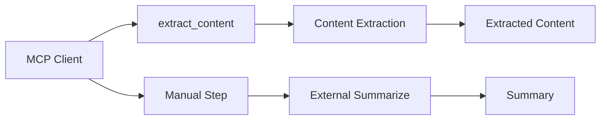
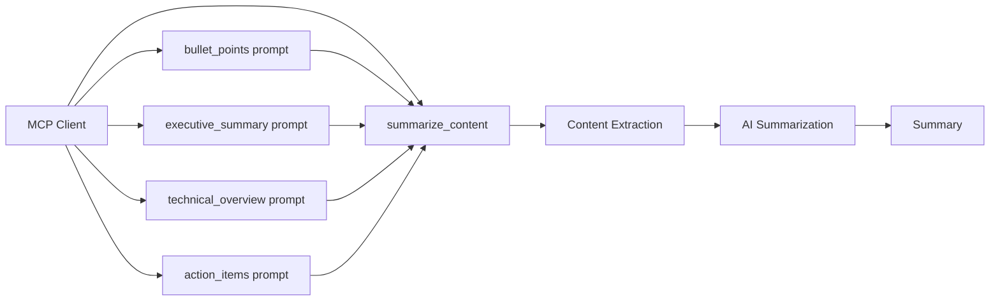

# OSS-208: Architecture Document

## System Overview

### Current State (Before)


### Target State (After)


## Component Architecture

### 1. MCP Server Layer (`src/content_core/mcp/server.py`)

**Existing Components:**
- `FastMCP` instance managing the server
- `_extract_content_impl()` - Internal extraction implementation
- `@mcp.tool extract_content()` - Exposed extraction tool

**New Components to Add:**
- `@mcp.tool summarize_content()` - New combined tool
- `@mcp.prompt` decorators for 4 prompt functions
- Error handling with appropriate exceptions

### 2. Prompt Templates Layer (`prompts/mcp/`)

**New Directory Structure:**
```
prompts/
├── content/
│   ├── cleanup.jinja         (existing)
│   └── summarize.jinja        (existing)
└── mcp/                       (new)
    ├── bullet_points.jinja
    ├── executive_summary.jinja
    ├── technical_overview.jinja
    └── action_items.jinja
```

**Template Design:**
Each template will follow the pattern:
- System context setting the summarization style
- Placeholder for content: `{{ content }}`
- Optional context injection: `...`

### 3. Core Processing Layer

**Existing Dependencies:**
- `content_core.content.extraction.extract_content` - Handles all extraction logic
- `content_core.content.summary.summarize` - Handles AI summarization
- `content_core.templated_message` - Jinja template rendering
- `ai_prompter.Prompter` - Template engine

**Data Flow:**
1. MCP request → `summarize_content(source, style, custom_context)`
2. Extract content using `_extract_content_impl()`
3. Determine context (custom > style > default)
4. Load and render Jinja template if style is used
5. Call `summarize()` with content and context
6. Return summary text

## Implementation Details

### Tool Implementation

```python
# Pseudo-code structure
@mcp.tool
async def summarize_content(
    source: str,
    style: Optional[str] = None,
    custom_context: Optional[str] = None
) -> str:
    # 1. Input validation
    if not source:
        raise ValueError("Source parameter is required")
    
    # 2. Determine source type
    is_url = source.startswith(('http://', 'https://'))
    
    # 3. Extract content
    if is_url:
        result = await _extract_content_impl(url=source)
    else:
        result = await _extract_content_impl(file_path=source)
    
    if not result["success"]:
        raise Exception(result["error"])
    
    # 4. Determine summarization context
    if custom_context:
        context = custom_context
    elif style:
        # Load Jinja template for style
        template = load_template(f"mcp/{style}.jinja")
        context = template.render()
    else:
        context = "Provide a clear, comprehensive summary"
    
    # 5. Summarize
    from content_core.content.summary import summarize
    summary = await summarize(result["content"], context)
    
    return summary
```

### Prompt Implementation

```python
# Example for one prompt
@mcp.prompt
async def summarize_bullet_points(
    source: str,
    additional_context: Optional[str] = None
) -> str:
    """Extract key information as scannable bullet points."""
    context = f"Summarize in clear bullet points. {additional_context or ''}".strip()
    return await summarize_content(source=source, custom_context=context)
```

## Patterns and Best Practices

### Maintained Patterns
1. **Separation of Concerns**: MCP layer remains thin, delegating to core functions
2. **Error Propagation**: Exceptions bubble up for MCP framework to handle
3. **Async/Await**: Consistent async patterns throughout
4. **Template-based Prompts**: Using Jinja for maintainable prompt engineering

### New Patterns Introduced
1. **Template Hierarchy**: MCP-specific templates separate from content templates
2. **Context Priority Chain**: custom > style > default
3. **Prompt as Wrapper**: Prompts are thin wrappers around the tool

## External Dependencies

No new external dependencies. Using existing:
- `fastmcp` (v2.10.0) - Already in use
- `ai-prompter` (v0.2.3) - Already in use for Jinja
- `esperanto` (v1.2.0) - Already in use for AI models

## Constraints and Assumptions

### Technical Constraints
1. **Memory**: Large files still subject to existing extraction limits
2. **Rate Limits**: AI provider limits apply to summarization
3. **MCP Protocol**: Must conform to FastMCP's tool/prompt patterns
4. **Error Format**: Exceptions converted to MCP errors by framework

### Design Assumptions
1. Jinja templates can access same template path as existing prompts
2. FastMCP properly handles exception → error conversion
3. Content extraction preserves enough context for quality summarization
4. Single-step operation improves user experience significantly

## Trade-offs and Alternatives

### Trade-offs Made
1. **Flexibility vs Structure**: Chose to support both pre-defined styles AND custom context
2. **Template Location**: Separate `mcp/` folder vs inline strings (chose templates for maintainability)
3. **Error Handling**: Exceptions vs structured returns (chose exceptions per user preference)

### Alternatives Considered
1. **Hardcoded Contexts**: Simpler but less maintainable
2. **Multiple Tools**: One tool per style - rejected for API surface complexity
3. **Direct Prompt Implementation**: Prompts doing extraction+summarization directly - rejected for code duplication

## Negative Consequences

1. **Increased Complexity**: MCP server now depends on summarization pipeline
2. **Error Opacity**: Exception-based errors may be less informative than structured errors
3. **Template Management**: Another set of templates to maintain
4. **Testing Complexity**: Need to mock both extraction AND summarization

## Files to be Modified/Created

### Files to Create
1. `prompts/mcp/bullet_points.jinja`
2. `prompts/mcp/executive_summary.jinja`
3. `prompts/mcp/technical_overview.jinja`
4. `prompts/mcp/action_items.jinja`
5. `tests/unit/test_mcp_summarize.py`

### Files to Modify
1. `src/content_core/mcp/server.py` - Add tool and prompts
2. `tests/unit/test_mcp_server.py` - Ensure no regressions
3. `docs/mcp.md` - Document new capabilities

## Testing Strategy

### Unit Test Coverage
```python
# tests/unit/test_mcp_summarize.py
class TestMCPSummarize:
    # Tool tests
    - test_summarize_content_with_url
    - test_summarize_content_with_file
    - test_summarize_content_with_style
    - test_summarize_content_with_custom_context
    - test_summarize_content_custom_overrides_style
    - test_summarize_content_invalid_source
    - test_summarize_content_extraction_failure
    
    # Prompt tests  
    - test_bullet_points_prompt
    - test_executive_summary_prompt
    - test_technical_overview_prompt
    - test_action_items_prompt
    - test_prompt_with_additional_context
```

## Migration and Rollback

### Migration Steps
1. Deploy new MCP server version
2. Existing `extract_content` tool continues to work
3. Clients can gradually adopt `summarize_content`
4. Documentation guides users to new workflow

### Rollback Plan
1. No breaking changes to existing functionality
2. New tool/prompts can be disabled without affecting existing tools
3. Version pinning available for clients requiring stability

## Success Metrics

### Technical Metrics
- All unit tests passing
- No performance regression in `extract_content`
- Response time <10s for typical documents
- Memory usage within existing bounds

### User Experience Metrics
- Successful tool discovery in Claude Desktop
- All 4 prompts appearing in prompt list
- Custom context working as expected
- Error messages helpful for debugging